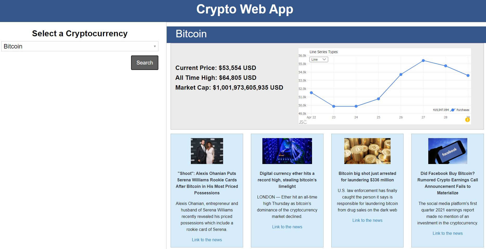

# Project1-Crypto-Investor

## Description ##

We develop a webpage whose objective is to be able to consult the main financial indicators for fourth Cryptocurrencies (Bitcoin, Ethereum, Litecoin and Dogecoin). The indicators displayed are Current Price, All Time High and Market Cap. In addition to this, a chart with the All Time High price in the last days is shown. At the bottom of the tool is a list of cards with the main news of the day related to the selected cryptocurrency.

## User Story ##

```
AS AN investor in cryptocurrencies
I WANT to see the prices and news of four selected cryptocurrencies  
SO THAT I can make an informed investment decision.
```

## Given that I'm an investor, ##

```
WHEN the webpage is displayed
THEN I can see a dropdown with the four previous selected Cryptocurrencies in the left side of the screen.
WHEN I selected a Cryptocurrency and pres
s the search button,
THEN the information of the Cryptocurrency is displayed in the rigth side of the screen.
WHEN I hover over the graph data,
THEN I can see the price of the cryptocurrency in days past.
WHEN I click on the links to the news,
THEN It directs me to the page of the news portal to read it.
 ```

## Technologies ##

This project was developed using:

* HTML5
* CSS3
* JQuery
* ZURB Foundation
* MomentJS
* CoinGecko API
* GNews API

## Mock-Up ##



Link to the page: https://erickcc.github.io/Project1-Crypto-Investor/